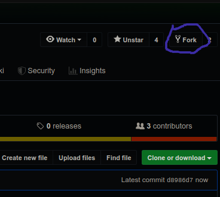
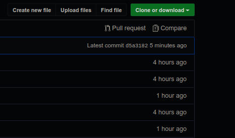
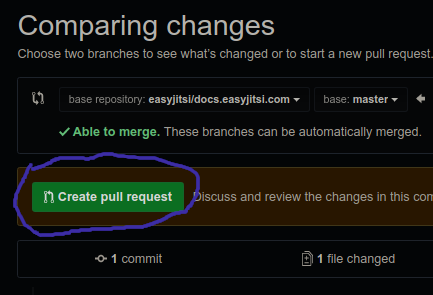
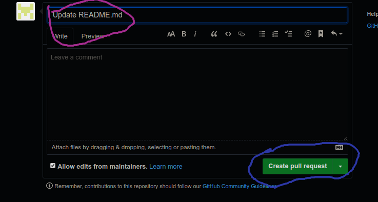

# How to contribute

We would love to have your help. Before you start working however, please read
and follow this short guide.

## Quick Guide

### 1. Fork The Repository

</img>

### 2. Clone the Repository and commit your changes

Once you clone the repository you can use these instructions to start a local development by running the following commands in the cloned directory:

#### Using Yarn

```bash
yarn install && yarn start
```

#### Using NPM

```bash
npm install && npm run-script start
```

This command starts a local development server and open up a browser window. Most changes are reflected live without having to restart the server.

### 3. Make A Your Pull Request

</img>

### 4. Create A Pull Request

</img>

### 5. Add Your Commit Description And Create Your Pull Request

</img>

### Done😁
